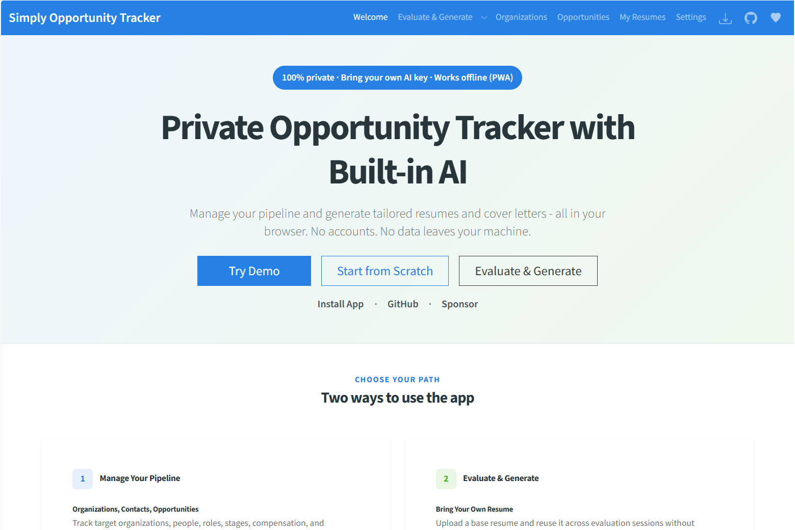

# Simply Opportunity Tracker

A browser-based opportunity management system for structured searches in any sector — jobs, academic positions, contracts, government roles, and more. Track organizations, contacts, and opportunities through every stage of the process. When you are ready to apply, generate tailored application materials using your own AI API key — entirely in your browser, with no data leaving your device.

**[Live App on GitHub Pages](https://dbakuntsev.github.io/simply.job-application/)**



---

## Overview

Simply Opportunity Tracker combines a full opportunity pipeline with an AI-powered Evaluate & Generate workflow:

- **Pipeline management** — Organizations → Contacts → Opportunities → Correspondence, tracked from first contact to final decision.
- **Evaluate & Generate** — Score your fit against any role, identify strengths and gaps, then generate a tailored resume, cover letter, and why-apply summary.
- **Ad-hoc mode** — Use Evaluate & Generate as a standalone tool without creating organization or opportunity records first.
- **Installable PWA** — Install as a desktop or mobile app for offline access and a native app experience.

All data is stored in your browser's IndexedDB. The only external calls are to your chosen AI provider using your own key.

---

## Features

### Opportunity Pipeline
- Organizations with contacts, industry, size, website, and LinkedIn
- Opportunities with stage tracking (Open → Applied → Interview → Offer → Accepted, and more), role description, work arrangement, compensation range, and required / preferred qualifications
- Multiple posting URLs per opportunity — track the same role across LinkedIn, company site, and aggregators
- AI-powered qualification extraction from role descriptions
- Full change history per opportunity (every edit recorded with old values)
- Correspondence log per opportunity: emails, phone calls, video calls, interviews, resume submissions, and more — with file attachments and contact associations

### Evaluate & Generate
- Match score (Poor / Fair / Good / Excellent) with strengths, gaps, and ATS keyword suggestions
- Tailored resume exported as DOCX — hyperlinks and formatting preserved
- Side-by-side diff between any generated resume and its base resume, so you can see exactly what the AI changed before sending
- Two-paragraph cover letter (DOCX) and concise why-apply summary
- Pre-fill from a linked Opportunity, or run in ad-hoc mode with free-text input
- Session history retained indefinitely; browse all past sessions from the History sub-menu

### Ask Question
- In-page modal on Evaluate & Generate and any History session detail — answer "Tell me about a time you…", "Why are you interested in this role?", "Are you authorized to work in…?", and similar free-text questions
- Two-stage AI pipeline: Stage 1 classifies the question into one of nine strategy categories (FitNarrative, MotivationNarrative, RelevantExperience, BehavioralExample, DirectFactual, EligibilityOrCompliance, CompensationOrLogistics, GapOrWeakness, Other) and selects the strongest resume evidence; Stage 2 generates the final answer under that strategy's tone and length constraints
- Three tones (Formal / Conversational / Concise) and three lengths (1–3 sentences or paragraphs), with on-demand "estimate length" suggestion based on the question shape
- Strict-factual questions (eligibility, compensation, certifications) that the resume doesn't support are gated at Stage 1 and return an honest "I cannot determine that" rather than fabricating an answer
- Runtime quality validation against the same rule library the offline harness uses (`Services/QnA/QualityRules.cs`) — Stage 2 output that violates a rule (e.g. drops a metric, opens with a forbidden template, leaks an item from the boundaries list) triggers a single re-prompt with the violations as feedback
- All Q&A sessions persisted in History alongside Evaluate & Generate sessions; full transcript including Stage 1 classification + selected priorities + every retry attempt browsable from the History sub-menu

### My Resumes
- Upload and manage named resumes with full version history
- Side-by-side diff viewer to compare any two versions
- Restore any prior version; auto-select latest version in Evaluate & Generate

### Progressive Web App (PWA)
- Install as a desktop or mobile app directly from the browser — no app store required
- Full offline support: all pipeline and history features work without a network connection (AI generation requires a live connection to your AI provider)
- Automatic update notifications: a banner appears when a new version is available; reload applies the update instantly
- Downloads in standalone mode use the File System Access API (`showSaveFilePicker`) when available, with a blob-URL fallback and toast notification

### Data Integrity
- Optimistic locking with version conflict detection across browser tabs
- Cross-tab live updates via BroadcastChannel — all open tabs stay in sync
- Cascade deletes handled in single IndexedDB transactions
- Navigation guards on all edit forms — unsaved changes are never silently lost
- Full data export as a compressed backup (.json.gz); import to restore or migrate to another browser or device

### Privacy
- All data stored in browser IndexedDB only — nothing persisted server-side
- Configurable AI provider (currently OpenAI)
- API key stored in browser local storage only

---

## Getting Started

### Prerequisites

- An API key from a supported AI provider (e.g. [OpenAI](https://platform.openai.com/api-keys))
- A resume in DOCX format

### Using the Hosted Version

1. Open the [live demo](https://dbakuntsev.github.io/simply.job-application/)
2. Go to **Settings** and enter your AI provider API key
3. Go to **My Resumes** and upload your resume in DOCX format
4. Go to **Organizations**, add a target organization, and create an Opportunity
5. Open the Opportunity and click **Evaluate & Generate**

Or skip straight to **Evaluate & Generate** for a quick ad-hoc session.

### Try a Demo

If you'd like to explore the app before adding your own data, click **Try Demo** on the Welcome page. This populates a fresh browser with sample organizations, contacts, opportunities, correspondence, and history sessions — no API key required to browse. The demo data lives in your local IndexedDB just like real data, so you can edit, delete, or clear it from **Settings → Data**.

### Installing as a Desktop App

The app can be installed as a PWA from any Chromium-based browser (Chrome, Edge, Arc) or Safari on iOS/macOS:

- **Chrome / Edge**: click the install icon (⊕) in the address bar, or use the install button on the page
- **Safari on iOS**: tap Share → Add to Home Screen

### Running Locally

```bash
git clone https://github.com/dbakuntsev/simply.job-application.git
cd simply.job-application
dotnet run
```

Requires [.NET 8 SDK](https://dotnet.microsoft.com/download/dotnet/8.0).

To run the unit-test suite (~380 tests covering Q&A prompts, quality rules, IndexedDB CRUD, navigation guards, and cross-tab sync):

```bash
dotnet test Simply.JobApplication.Tests
```

For Q&A prompt regression testing against the live OpenAI API, see [Q&A Test Harness](#qa-test-harness) below.

---

## Privacy

| Data | Where it goes |
|------|---------------|
| Organizations, contacts, opportunities, correspondence | Browser IndexedDB only — never leaves your device |
| Resumes, evaluation results, generated files | Browser IndexedDB only |
| AI provider API key | Browser local storage only |
| AI prompts and resume content | Sent directly to your chosen AI provider using your key, subject to that provider's data policy |
| Exported backup files | Downloaded to your local filesystem — never transmitted anywhere |

---

## Tech Stack

- [Blazor WebAssembly](https://learn.microsoft.com/aspnet/core/blazor/) (.NET 8)
- [Bootstrap 5](https://getbootstrap.com/) with [Cosmo theme](https://bootswatch.com/cosmo/)
- [Radzen.Blazor](https://blazor.radzen.com/) — dropdowns, tags, markdown rendering
- [BlazorMonaco](https://github.com/serdarciplak/BlazorMonaco) — markdown editor and diff viewer
- [OpenAI Responses API](https://platform.openai.com/docs/api-reference/responses) with server-sent events streaming
- Browser IndexedDB for local persistence; BroadcastChannel for cross-tab sync; Web Locks for write serialization
- Service Worker (production-only) for offline caching and PWA update flow
- GitHub Actions for `dotnet test` on every push, release packaging, and GitHub Pages deployment

---

## Project Structure

```
Simply.JobApplication/             Main Blazor WASM app

  Pages/
    WelcomePage.razor              Landing page (smart redirect for returning users)
    OrganizationListPage.razor     Organizations list with search
    NewOrganizationPage.razor      Add organization form
    OrganizationDetailPage.razor   Organization detail with contacts, opportunities, and sessions
    AddOpportunityPage.razor       Add opportunity form
    OpportunityDetailPage.razor    Opportunity detail with correspondence and E&G sessions
    OpportunityListPage.razor      Cross-organization opportunity report
    EvaluateAndGeneratePage.razor  AI match scoring and material generation
    HistoryPage.razor              Session history list
    HistoryDetailPage.razor        Session detail view
    MyResumesPage.razor            Resume library with version management
    SettingsPage.razor             API key, model, storage, and data export/import

  Components/
    PwaUpdateBanner.razor          Dismissible banner shown when a new app version is waiting
    AppToastHost.razor             Toast notification host (replaces transient success banners)
    MarkdownEditor.razor           Monaco-based markdown editor
    TagPicker.razor                Select2-based tag picker for role labels
    NavigationGuardModal.razor     Unsaved-changes confirmation modal
    ConflictAlertModal.razor       Cross-tab version conflict alert
    DeletionAlertModal.razor       Remote deletion warning modal
    ConfirmDeleteModal.razor       Generic delete confirmation modal
    ResumeDiffModal.razor          Side-by-side DOCX diff viewer
    AskQuestionModal.razor         Q&A input modal (tone, length, estimate-length action)
    QuestionAnswerDetailModal.razor  Q&A session detail viewer (Stage 1 focus + Stage 2 transcript + retries)
    SaveOpportunityModal.razor     Shared 3-step state machine for creating an Opportunity with on-the-fly Organization creation

  Services/
    IndexedDbService.cs            All IndexedDB reads and writes
    DataSyncService.cs             BroadcastChannel cross-tab notifications
    DocxService.cs                 DOCX ↔ Markdown extraction and generation
    PwaService.cs                  PWA state: install prompt, standalone detection, update detection
    AppStartupService.cs           DB migration, lookup seeding, startup checks
    AppToastService.cs             Singleton toast queue; pages enqueue, AppToastHost renders
    DemoDataService.cs             "Try Demo" loader: seeds organizations, contacts, opportunities, correspondence, and history sessions
    AI/
      IAiProvider.cs               Provider interface
      OpenAi/OpenAiProvider.cs     OpenAI implementation (Evaluate, Generate, two-stage Q&A)
      IRateLimitGate.cs            Process-wide token-bucket admission gate (header-driven, self-calibrating)
    QnA/
      QualityRules.cs              Executable mirror of Stage 2 prompt rules (regex + structural detectors)
      QualityValidator.cs          Runs rules over Stage 2 output; used by both runtime sampler and offline harness
      Stage2RejectionSampler.cs    Runtime quality gate: re-prompts Stage 2 with violations as feedback (per-call retry budget); persists per-attempt telemetry for forensic replay

  wwwroot/
    service-worker.js              Dev stub (no-op install/activate)
    service-worker.published.js    Production SW: precache, offline fallback, update flow
    manifest.webmanifest           PWA manifest (version stamped from GitHub release tag at deploy)
    js/pwa.js                      Install prompt capture, standalone detection, SW update signalling

Simply.JobApplication.Tests/       xUnit test suite (~380 tests, bUnit + plain unit tests)
  QA/                              Q&A prompt-marker tests + quality-rule detector tests
  Infrastructure/                  IndexedDB CRUD, versioned writes, cascade deletes, web locks, cross-tab sync
  Pages-by-area/                   Component tests per page (Organizations, Opportunities, Resumes, History, …)

Tools/QnA.Harness/                 Console harness: drives Q&A against the live OpenAI API across a matrix
                                   of (fixture × strategy × tone × length) and writes analysable artifacts.
                                   See the "Q&A Test Harness" section below.
```

---

## Q&A Test Harness

The **Q&A feature** (`AnswerQuestionAsync` in `OpenAiProvider.cs`) drives one of the longest prompts in the codebase: a two-stage Responses-API call where Stage 1 classifies the question and selects evidence, and Stage 2 generates the final answer under tight style and source-fidelity constraints. Prompts of this complexity drift quickly — a single re-worded rule can shift answer quality in non-obvious ways, and a single new rule can produce compensating regressions elsewhere.

`Tools/QnA.Harness/` is a console project that exercises this pipeline against the live OpenAI API across a matrix of test inputs, then writes structured artifacts the included analysers consume. It exists to make prompt-iteration decisions evidence-driven instead of feel-driven.

### What it does

Given a clean git tree and an OpenAI API key, the harness:

1. Loads built-in **fixtures** — paired (resume, role description, organization description) tuples representing realistic application contexts. Two fixtures ship: a software-engineering role and an events-coordinator role.
2. For each fixture, generates **questions** in nine strategy categories (FitNarrative, MotivationNarrative, RelevantExperience, BehavioralExample, DirectFactual, EligibilityOrCompliance, CompensationOrLogistics, GapOrWeakness, Other).
3. Runs each question through `AnswerQuestionAsync` at three tones (Formal, Conversational, Concise) and three lengths (1, 2, 3 sentences).
4. Records per-session: the Stage 1 classification + selected evidence, the Stage 2 answer, latency and token counts per stage, total cost, and any errors.
5. Anchors every artifact to the producing commit SHA — runs against a dirty working tree are refused by default.

The full matrix is **162 sessions ≈ 324 OpenAI requests**, roughly $0.50–$2 depending on which `gpt-5.4` family model is used.

### When to use it

- After editing the Stage 1 or Stage 2 prompt in `Services/AI/OpenAi/OpenAiProvider.cs`, to confirm the change does what you intended and didn't compensate-regress elsewhere.
- After editing `Services/QnA/QualityRules.cs`, since the rule library is the executable mirror of the Stage 2 prompt — analyser output is only as accurate as the rules.
- Before merging any Q&A-touching change, to record a baseline trend point under the new code.

### Setup

Put your API key in `.env` at the repo root (gitignored, auto-loaded):

```
OPENAI_API_KEY=sk-...
```

Or pass it on every invocation via `--api-key <key>`.

### Running

```bash
# Full matrix — 162 sessions, all strategies × all tones × all lengths
dotnet run --project Tools/QnA.Harness

# Focused subset — fast iteration on specific failure modes
dotnet run --project Tools/QnA.Harness -- \
  --fixtures events,software \
  --strategies BehavioralExample,GapOrWeakness,CompensationOrLogistics \
  --tones Concise,Conversational,Formal \
  --lengths 1,2,3

# Dry run — list planned sessions without making any API calls
dotnet run --project Tools/QnA.Harness -- --dry-run

# Split-model run — cheap classifier for Stage 1, full model for Stage 2
dotnet run --project Tools/QnA.Harness -- --model gpt-5.4 --stage1-model gpt-5.4-mini
```

Filters compose freely. The harness self-calibrates against OpenAI's `x-ratelimit-*` response headers — there is no `--tpm` knob to tune.

### Output

Each run writes a timestamped directory under `Tools/QnA.Harness/runs/<UTC-ts>/` (gitignored):

| File | Contents |
|---|---|
| `run-meta.json` | Total tokens, USD cost, per-step breakdown, git commit SHA/branch/dirty-flag, observed rate-limit snapshots per model. The forensic anchor — one read tells you cost and what code produced these results. |
| `index.json` | Flat array, one entry per session: ids, strategy match, latencies, totals, answer previews, errors. Use this to grep/filter before reading details. |
| `sessions/<sessionId>.json` | Full per-session detail: inputs, Stage 1 focus JSON, selected priorities, Stage 2 answer text, usage records, errors. |
| `summary.md` | Human-readable per-strategy tables, errors section, totals — best file for a quick visual scan. |

### Analysis subcommands

Three subcommands consume the artifacts. All write Markdown to stdout (and to disk alongside the source run) and pair with `.claude/skills/` of the same names if you're using Claude Code:

```bash
# Per-run quality report — applies QualityRules to every session and reports
# per-rule incidence + worst offenders + sentinel-suppressed counts.
dotnet run --project Tools/QnA.Harness --no-build -- analyze-run <run-id-or-latest>

# Did the fix work? Diff two runs against the current rule library, classify
# every shared session as identical / improved / regressed / mixed, and show
# side-by-side answer text for the regressions.
dotnet run --project Tools/QnA.Harness --no-build -- compare-runs <baseline> <candidate>

# Forensic trend across all runs — joins to git commits, computes failure
# rates (mismatch, insufficient, error) and cost, partitions by (model,
# stage1Model), and emits a Markdown report.
dotnet run --project Tools/QnA.Harness --no-build -- summarize-history
```

### Git anchoring

Runs against a dirty working tree are refused with exit code 3 — the commit SHA in `run-meta.json` would misrepresent the code that actually ran. Override with `--allow-dirty` for ad-hoc exploration only; the resulting artifact is marked `isDirty: true` and is not safe to feed into trend analysis. Any run intended to be reported as "what this commit produces" should be on a clean tree.

### Extending

- **New fixture** — add a `Fixture` constant in `Tools/QnA.Harness/Fixtures.cs`, append to `_all`, and add a matching question bank entry in `QuestionBank.cs` covering all nine strategies.
- **New Responses-API call site in `OpenAiProvider`** — pass a fresh short `step` label (kebab-case) to `CreateResponseWithTextAsync` / `ContinueResponseAsync`. It flows into `UsageRecord.Step` and groups under `run-meta.json → usageTotals.byStep`.
- **New quality rule** — add to `Services/QnA/QualityRules.cs` so both the runtime rejection sampler and the offline analyzer pick it up. Adding a rule to the Stage 2 prompt without adding a detector is the drift mode the library exists to prevent — the prompt rule then has no external feedback when the model slips.

---

## License

[MIT](LICENSE) © 2026 Dmitry Bakuntsev
